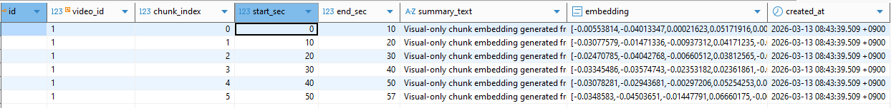
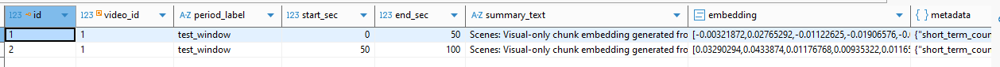
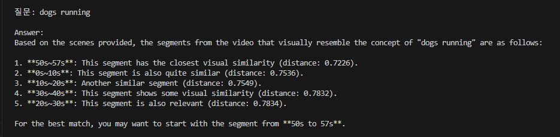

## 주요 구현 사항 (Key Implementations)

### 1. 데이터 인제스트 및 처리 (Data Ingestion)
* **비디오 프로세싱:** 비디오를 10초 단위의 청크(Chunk)로 분할하고, 각 청크당 3프레임씩 샘플링하는 인제스트 파이프라인 구축
* **임베딩 저장:** CLIP 기반 비주얼 임베딩을 생성하여 `pgvector`에 저장 및 인덱싱
* **처리 최적화:** `extract_video`와 `fast_ingest`를 분리하여 운영
    * **기본 저장 모드:** 모든 데이터의 표준 저장 처리
    * **유사 청크 병합 모드:** 임베딩 유사도 기반 중복 데이터 최적화

### 2. 메모리 및 데이터베이스 스키마 확장
* **다단계 스키마 구조:** `video_events`, `video_short_suammaries`, `video_long_summaries`를 포함하는 확장된 DB 스키마 설계
* **계층적 요약 (Hierarchical Summarization):** * `make_summary`: 청크와 이벤트를 결합해 Short-term/Long-term 요약 텍스트 생성
    * `build_memory`: 요약된 텍스트를 다시 임베딩하여 계층별 메모리 테이블에 저장
* **씬 요약(Scene Summary):** 현재 프레임의 밝기 및 움직임 데이터를 기반으로 한 경량 씬 분석 기반 요약 적용

#### 결과 예시
 

### 3. 검색 아키텍처 (Search Strategy)
* 단순 Raw 데이터 검색에서 탈피하여 **Short-term → Long-term → Raw Fallback** 순서로 탐색하는 하이브리드 검색 구조 구현
* 상위 계층(Summary)에서 문맥을 먼저 파악하고 필요시 하위(Raw) 데이터를 참조하여 검색 속도와 정확도 향상

## Key Implementations

### 1. Data Ingestion & Processing
* **Video Processing Pipeline:** Established a pipeline to segment videos into 10-second chunks with a 3-frame sampling rate.
* **Vector Embedding:** Integrated **CLIP-based visual embeddings** stored and indexed within `pgvector`.
* **Dual Ingestion Modes:** Separated `extract_video` and `fast_ingest` for specialized processing:
    * **Standard Storage:** Reliable sequential data ingestion.
    * **Similar Chunk Merging:** Optimization via embedding similarity to merge redundant visual data.

### 2. Memory & Schema Architecture
* **Extended DB Schema:** Designed a multi-layered schema including `video_events`, `video_short_summaries`, and `video_long_summaries`.
* **Hierarchical Summarization:**
    * `make_summary`: Aggregates chunks and events into cohesive short-term and long-term textual summaries.
    * `build_memory`: Embeds summary texts into dedicated memory tables for semantic retrieval.
* **Lightweight Scene Summary:** Implemented scene analysis based on frame brightness and motion dynamics for initial context generation.

### 3. Search Strategy
* **Layered Retrieval Logic:** Transitioned from raw-only search to a sophisticated **Short-term → Long-term → Raw Fallback** search flow.
* This hierarchical approach ensures high-level context understanding while maintaining the ability to access granular raw data when necessary.
